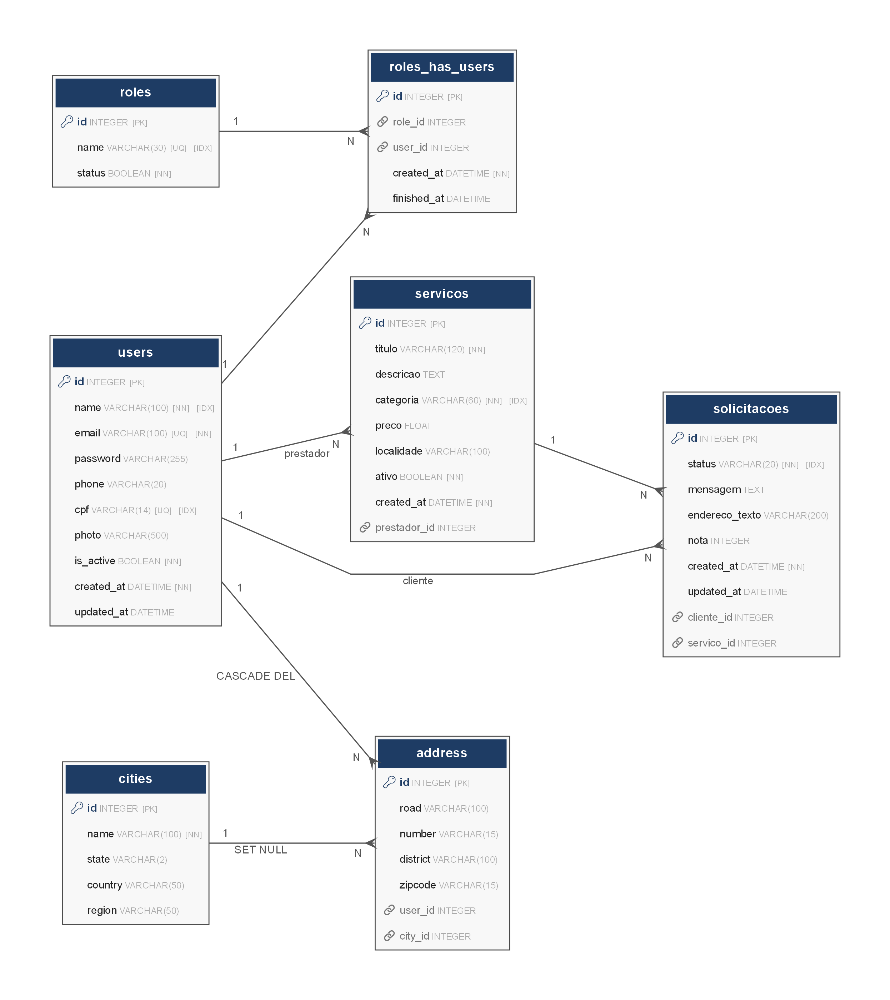

# HelpNOW 🔧

> Plataforma web para solicitação rápida de serviços domésticos.

Conecta **clientes** que precisam de serviços (elétrica, hidráulica, limpeza, TI, pintura) a **prestadores autônomos** cadastrados, simplificando a contratação sem depender de indicações informais.

Projeto desenvolvido para a disciplina de **Desenvolvimento Web — UVV**  
**Grupo:** Antony Novais · Heitor Rodrigues · Thomás Kriger

---

## Demonstração

| Tela inicial (cliente) | Busca de profissionais | Painel do prestador |
|---|---|---|
|  | *(busca por categoria/localidade)* | *(painel de solicitações)* |

> 💡 Substitua as células acima por capturas de tela reais do projeto!

---

## Funcionalidades

- Cadastro de **clientes** e **prestadores** com papéis distintos
- Prestadores cadastram serviços com categoria, descrição, preço e localidade
- Clientes buscam profissionais por **categoria** e/ou **localidade**
- Envio de solicitações de serviço com mensagem e endereço
- Prestadores **aceitam ou recusam** solicitações recebidas
- Clientes marcam serviços como **concluídos** e deixam uma **avaliação (1–5)**
- Edição de perfil para ambos os tipos de usuário

---

## Stack tecnológica

| Camada | Tecnologia |
|---|---|
| Backend | Python 3.11 · Flask · Flask-Login · Flask-WTF |
| ORM | SQLAlchemy 2.x · Flask-SQLAlchemy |
| Frontend | Jinja2 · Bulma 0.9.4 · Font Awesome 6 |
| Banco de dados | SQLite (dev/test) |
| Testes | pytest · pytest-flask · pytest-cov |
| Automação | Invoke (`tasks.py`) |

---

## Diagrama do banco de dados


---

## Como rodar o projeto

### Pré-requisitos

- Python 3.9 ou superior
- pip

### 1. Clone e crie o ambiente virtual

```bash
git clone https://github.com/SEU_USUARIO/helpnow.git
cd helpnow
python -m venv venv

# Linux / macOS
source venv/bin/activate

# Windows (PowerShell)
venv\Scripts\Activate.ps1
```

### 2. Configure as variáveis de ambiente

```bash
# Copie o arquivo de exemplo
cp .env.example .env.dev

# Abra .env.dev e preencha as variáveis (SECRET_KEY no mínimo)
```

> Gere uma SECRET_KEY segura:
> ```bash
> python -c "import secrets; print(secrets.token_hex(32))"
> ```

### 3. Instale as dependências

```bash
pip install -e ".[dev,test]"

# Ou via Invoke:
invoke install
```

### 4. Crie o banco de dados

```bash
flask create-db
```

### 5. (Opcional) Popule com dados de exemplo

```bash
invoke seed-dev
```

Cria 3 usuários de teste — todos com senha `123456`:

| Tipo | E-mail |
|---|---|
| Cliente | `thomas@email.com` |
| Prestador | `heitor@email.com` |
| Prestador | `antony@email.com` |

### 6. Rode a aplicação

```bash
invoke run
# ou: flask run
```

Acesse: [http://localhost:5000](http://localhost:5000)

---

## Testes

```bash
invoke test
# ou: pytest -v
```

Os testes cobrem:
- Infraestrutura (criação do app, modo de teste)
- Rotas públicas (200 OK e HTML válido)
- Conteúdo da landing page
- Formulários de contato, login e cadastro
- Proteção de rotas autenticadas (redirect 302)

---

## Estrutura do projeto

```
helpnow/
├── app.py                    # Application factory (create_app)
├── pyproject.toml            # Dependências e metadados
├── tasks.py                  # Automação com Invoke
├── .env.example              # Template de variáveis de ambiente
├── gerar_er.py               # Gerador do diagrama ER
├── er_diagram.png            # Diagrama do banco de dados
│
├── helpnow/
│   ├── ext/                  # Extensões Flask
│   │   ├── config/           # Carregamento de configuração e .env
│   │   ├── db/               # Inicialização do SQLAlchemy
│   │   ├── login/            # Flask-Login
│   │   ├── wtf/              # Flask-WTF (CSRF)
│   │   ├── cli/              # Comandos flask (create-db, seed-dev)
│   │   └── debugtoolbar/     # Debug toolbar (dev)
│   │
│   ├── models/               # Modelos SQLAlchemy
│   │   ├── user.py           # Usuário + endereços
│   │   ├── servico.py        # Serviço ofertado
│   │   ├── solicitacao.py    # Solicitação de serviço
│   │   ├── role.py           # Papel (Cliente / Prestador)
│   │   ├── role_user.py      # Associação usuário↔papel
│   │   └── location.py       # Cidade e endereço
│   │
│   ├── views/                # Blueprints Flask
│   │   ├── main.py           # Rotas principais (busca, contato, solicitações)
│   │   ├── auth.py           # Login, cadastro, logout
│   │   └── perfil.py         # Edição de perfil
│   │
│   └── forms/                # Formulários WTForms
│       ├── auth.py           # Login e cadastro
│       ├── perfil.py         # Edição de perfil
│       ├── servico.py        # Cadastro de serviço
│       └── main.py           # Contato e solicitação
│
├── templates/main/           # Templates Jinja2
├── static/css/               # CSS customizado (Bulma base)
└── tests/                    # Testes automatizados (pytest)
```

---

## Variáveis de ambiente

O projeto usa arquivos `.env.<ambiente>` carregados pelo Invoke:

| Arquivo | Uso |
|---|---|
| `.env.dev` | Desenvolvimento local |
| `.env.test` | Testes automatizados |
| `.env.prod` | Produção |

Variáveis principais: `SECRET_KEY`, `DATABASE_URL`, `FLASK_DEBUG`  
Para e-mail (produção): `MAIL_SERVER`, `MAIL_PORT`, `MAIL_USERNAME`, `MAIL_PASSWORD`

Copie `.env.example` e preencha — **nunca suba arquivos `.env` reais**.

---

## Licença

MIT License — veja [LICENSE](LICENSE) para detalhes.
