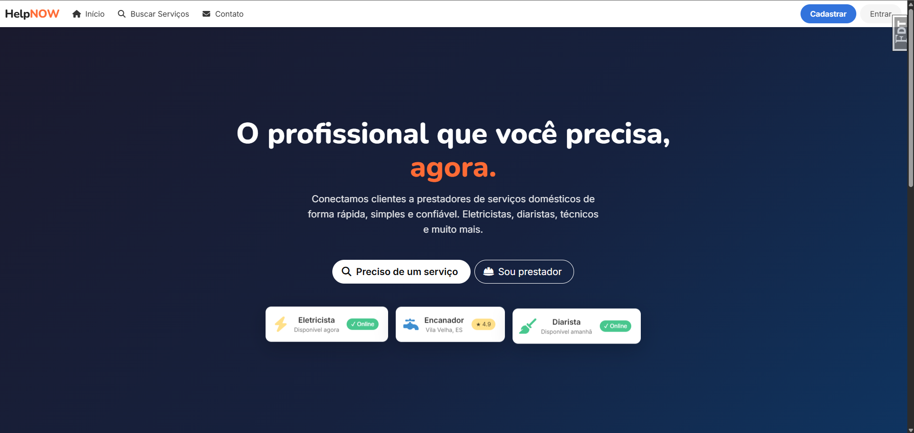
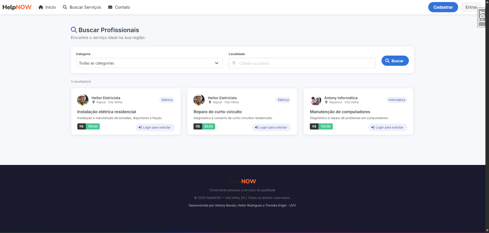
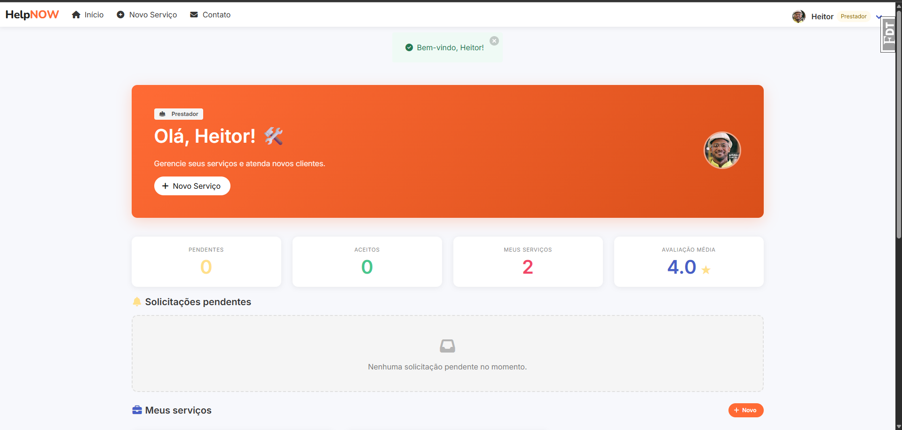
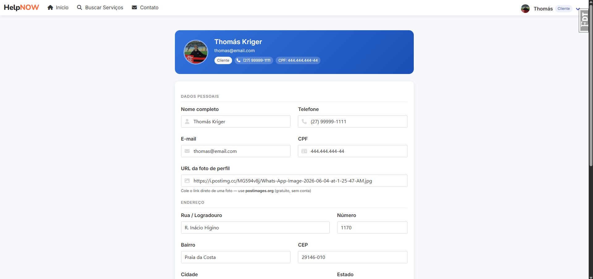

<div align="center">

# HelpNOW 🔧

**Plataforma web para solicitação rápida de serviços domésticos**

Conecta clientes que precisam de serviços (elétrica, hidráulica, limpeza, TI, pintura) a prestadores autônomos, simplificando a contratação sem depender de indicações informais.


&nbsp;

&nbsp;

&nbsp;


<br>

Projeto desenvolvido para a disciplina de **Desenvolvimento Web — UVV**  
**Grupo:** Antony Novais · Heitor Rodrigues · Thomás Kriger

</div>

---

## Capturas de tela

<table>
  <tr>
    <td align="center"><b>Página inicial</b></td>
    <td align="center"><b>Busca de profissionais</b></td>
  </tr>
  <tr>
    <td></td>
    <td></td>
  </tr>
  <tr>
    <td align="center"><b>Painel do prestador</b></td>
    <td align="center"><b>Perfil do usuário</b></td>
  </tr>
  <tr>
    <td></td>
    <td></td>
  </tr>
</table>

---

## Funcionalidades

- Cadastro de **clientes** e **prestadores** com papéis distintos
- Prestadores cadastram serviços com categoria, descrição, preço e localidade
- Clientes buscam profissionais por **categoria** e/ou **localidade**
- Envio de solicitações com mensagem e endereço
- Prestadores **aceitam ou recusam** solicitações recebidas
- Clientes marcam serviços como **concluídos** e deixam uma **avaliação (1–5)**
- Edição de perfil para ambos os tipos de usuário

---

## Stack tecnológica

| Camada | Tecnologia |
|---|---|
| Backend | Python 3.11 · Flask · Flask-Login · Flask-WTF |
| ORM | SQLAlchemy 2.x · Flask-SQLAlchemy |
| Frontend | Jinja2 · Bulma 0.9.4 · Font Awesome 6 |
| Banco de dados | SQLite (dev/test) |
| Testes | pytest · pytest-flask · pytest-cov |
| Automação | Invoke (`tasks.py`) |

---

## Diagrama do banco de dados


---

## Como rodar o projeto

### Pré-requisitos

- Python 3.9 ou superior

### 1. Clone o repositório

```bash
git clone https://github.com/KrigerThomas/helpnow.git
cd helpnow
```

### 2. Crie o ambiente virtual e instale o Invoke

O script abaixo cria o `venv`, ativa e instala o `invoke` — necessário para os próximos passos.

```bash
# Windows (PowerShell)
py .\scripts\make_env.py

# Linux / macOS
python3 -m venv venv
source venv/bin/activate
pip install invoke python-dotenv
```

### 3. Configure as variáveis de ambiente

```bash
# Copie o arquivo de exemplo
cp .env.example .env.dev

# Abra .env.dev e preencha ao menos a SECRET_KEY
```

> Gere uma SECRET_KEY segura:
> ```bash
> python -c "import secrets; print(secrets.token_hex(32))"
> ```

### 4. Instale as dependências do projeto

```bash
invoke install
```

### 5. Crie o banco de dados

```bash
flask create-db
```

### 6. (Opcional) Popule com dados de exemplo

```bash
invoke seed-dev
```

Cria 3 usuários de teste — todos com senha `123456`:

| Tipo | E-mail |
|---|---|
| Cliente | `thomas@email.com` |
| Prestador | `heitor@email.com` |
| Prestador | `antony@email.com` |

### 7. Rode a aplicação

```bash
invoke run
```

Acesse: [http://localhost:5000](http://localhost:5000)

> ⚠️ **Não use `flask run` diretamente** — o `invoke run` carrega o `.env.dev` automaticamente antes de iniciar o servidor. Sem ele, a aplicação não encontra a `SECRET_KEY` e outras variáveis.

---

## Testes

```bash
invoke test
```

> ⚠️ **Não use `pytest -v` diretamente** — o `invoke test` carrega o `.env.test` antes de rodar os testes, incluindo `WTF_CSRF_ENABLED=0` necessário para os formulários funcionarem nos testes.

Os testes cobrem rotas públicas, formulários, autenticação e proteção de rotas.

---

## Referência de comandos

| Comando | O que faz |
|---|---|
| `invoke run` | Inicia o servidor em modo desenvolvimento |
| `invoke test` | Roda os testes com `.env.test` |
| `invoke install` | Instala todas as dependências |
| `invoke seed-dev` | Popula o banco com dados de exemplo |
| `invoke lint` | Verifica qualidade de código (flake8) |
| `invoke format` | Formata o código automaticamente (black) |
| `invoke prod` | Inicia o servidor em modo produção |

---

## Estrutura do projeto

```
helpnow/
├── app.py                    # Application factory (create_app)
├── pyproject.toml            # Dependências e metadados
├── tasks.py                  # Automação com Invoke (invoke run, test…)
├── .env.example              # Template de variáveis de ambiente
├── LICENSE
├── README.md
│
├── .github/
│   ├── images/               # Screenshots do projeto (usadas no README)
│   └── workflows/
│       └── tests.yml         # CI — roda os testes a cada push
│
├── scripts/
│   ├── make_env.py           # Cria venv e instala invoke (Windows)
│   └── gerar_er.py           # Gera o diagrama ER do banco
│
├── docs/
│   └── er_diagram.png        # Diagrama do banco de dados
│
├── helpnow/
│   ├── ext/                  # Extensões Flask (db, login, config, cli…)
│   ├── models/               # Modelos SQLAlchemy (User, Servico, Solicitacao…)
│   ├── views/                # Blueprints e rotas (main, auth, perfil)
│   └── forms/                # Formulários WTForms (auth, servico, perfil…)
│
├── templates/main/           # Templates Jinja2
├── static/css/               # CSS customizado (Bulma base)
└── tests/                    # Testes automatizados (pytest)
```

---

## Variáveis de ambiente

Copie `.env.example` para `.env.dev` e preencha — **nunca suba arquivos `.env` reais**.

| Arquivo | Usado por |
|---|---|
| `.env.dev` | `invoke run` — desenvolvimento local |
| `.env.test` | `invoke test` — testes automatizados |
| `.env.prod` | `invoke prod` — produção |

---

## Licença

MIT License — veja [LICENSE](LICENSE) para detalhes.
